# PistoleroVR

PistoleroVR is my final year project for the Informatics Engineering degree.  
It consists of a FPS wave-based shooter for Oculus Quest, with cloud-based interactions for shop, data tracking, and daily rewards.  
Developed in Unity Engine (C#) using Unity Cloud interactions.

---

🎮 [**APK**](https://somozadev.itch.io/pistolerovr)

📄 [**Thesis**](https://github.com/somozadev/TFG_Informatica/blob/main/TFG_PistoleroVR_MarcosEladioSomozaCorral.pdf)  
🎞️ [**Presentation**](https://github.com/somozadev/TFG_Informatica/blob/main/PistoleroVR-Defensa.pdf)

> ⚠️ **Note**: This project was developed in Madrid, Spain. The thesis and presentation are written in Spanish.

## 🛠 Screenshots

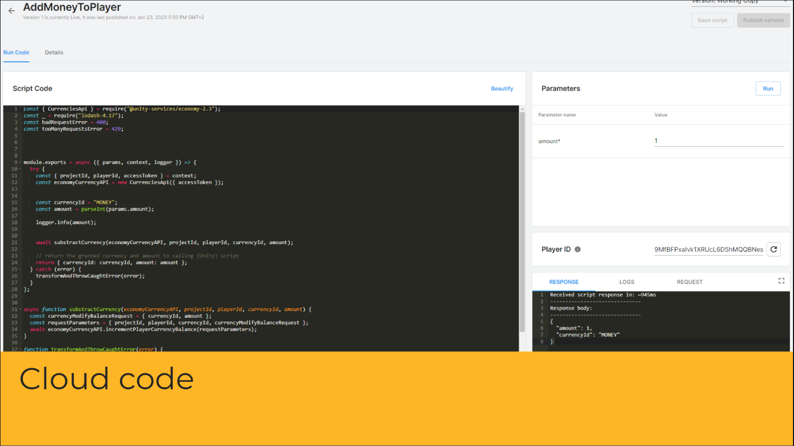
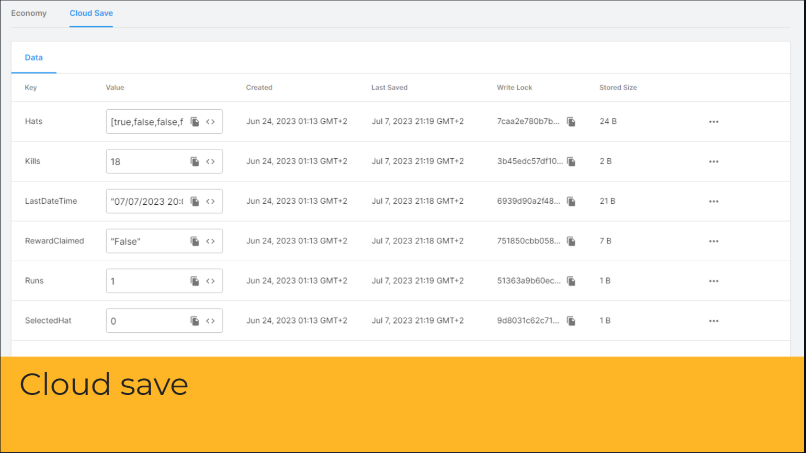
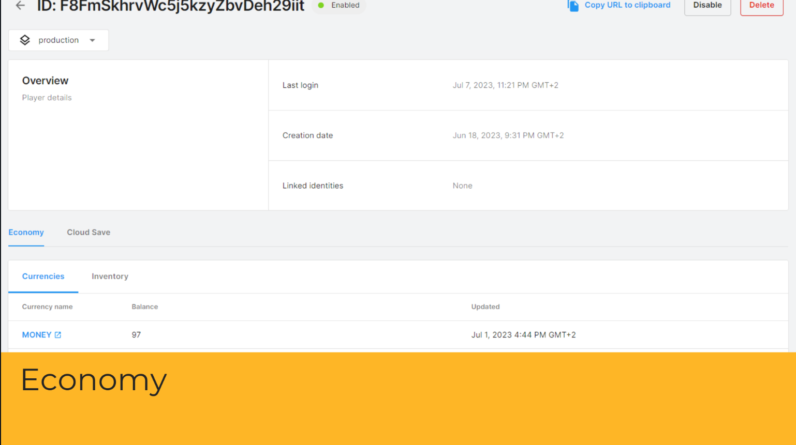

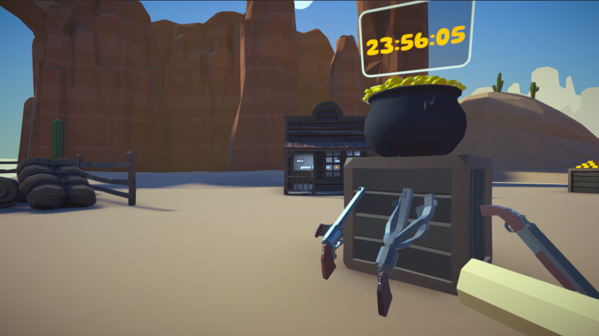
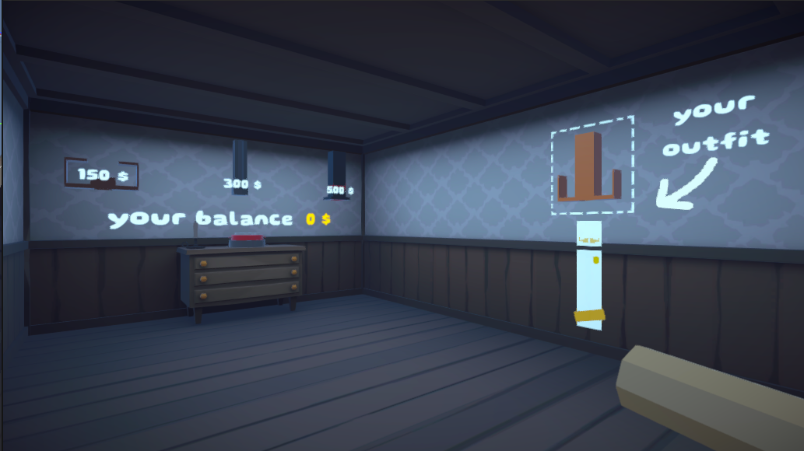
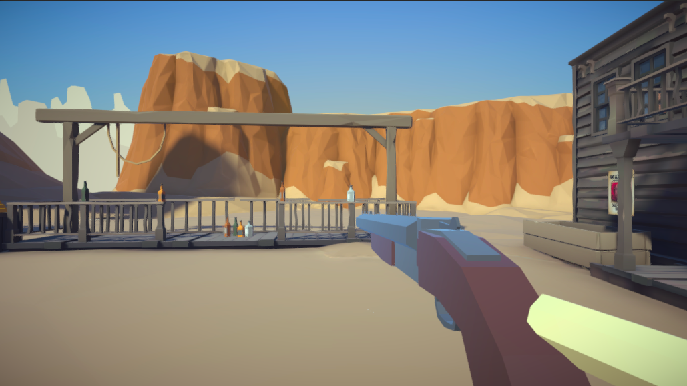
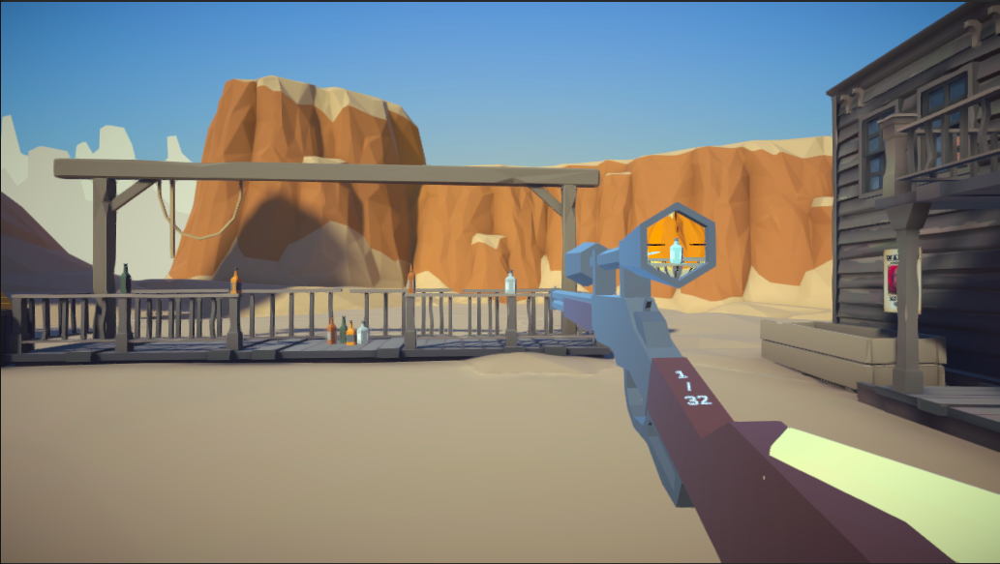
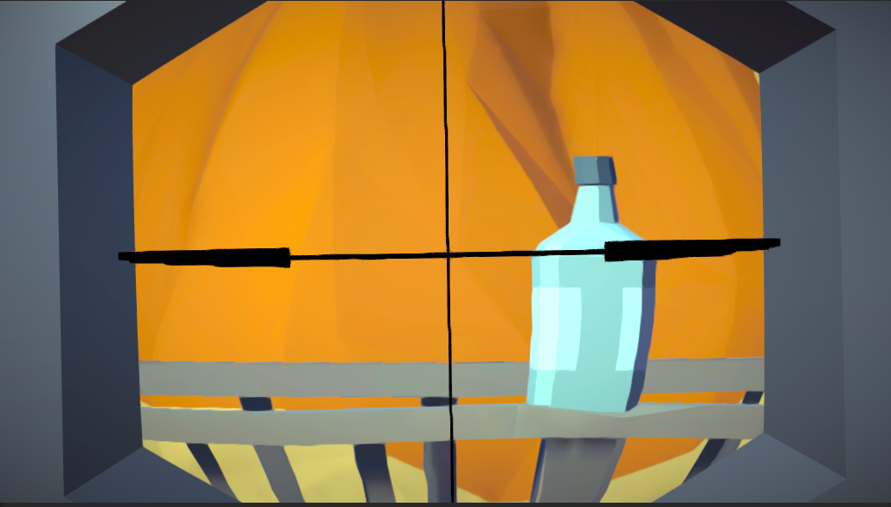
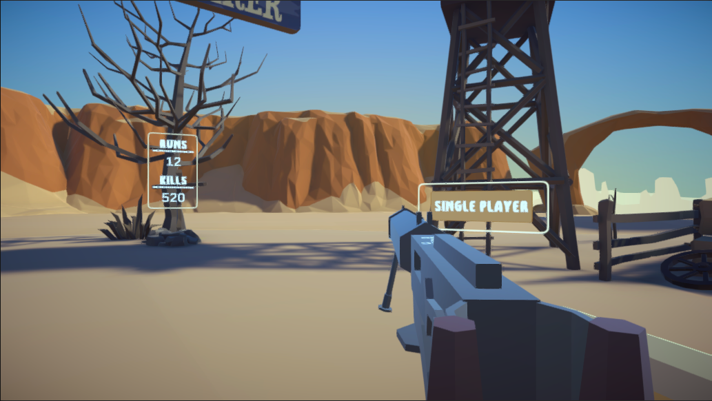

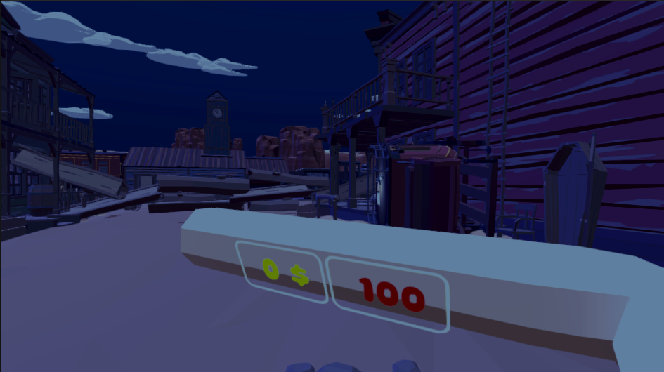
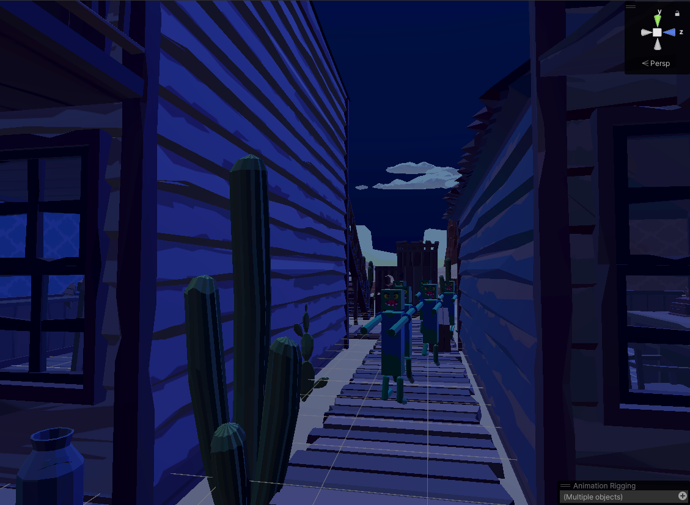
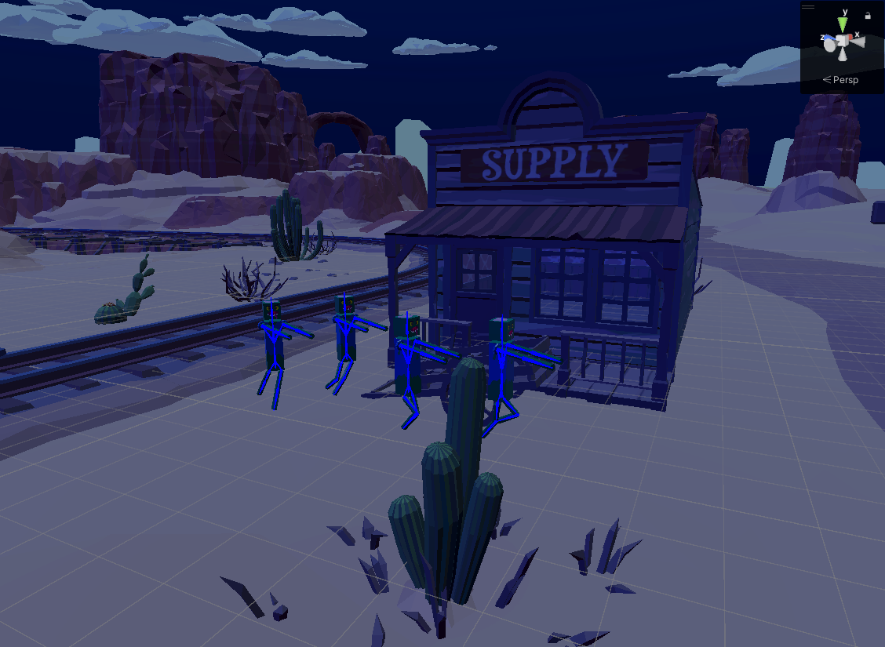
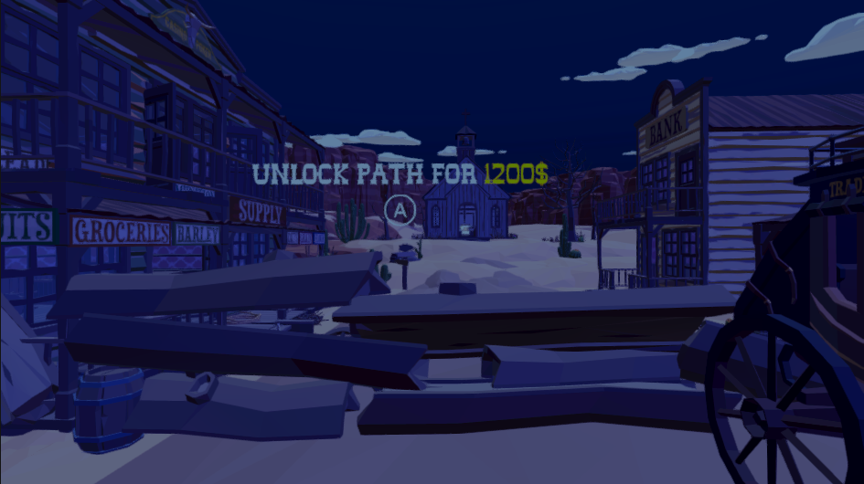
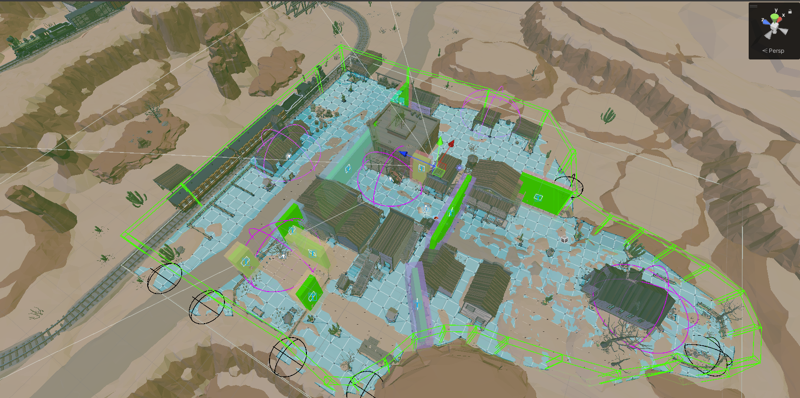

## **📄 License**
This project is licensed under the MIT License 

